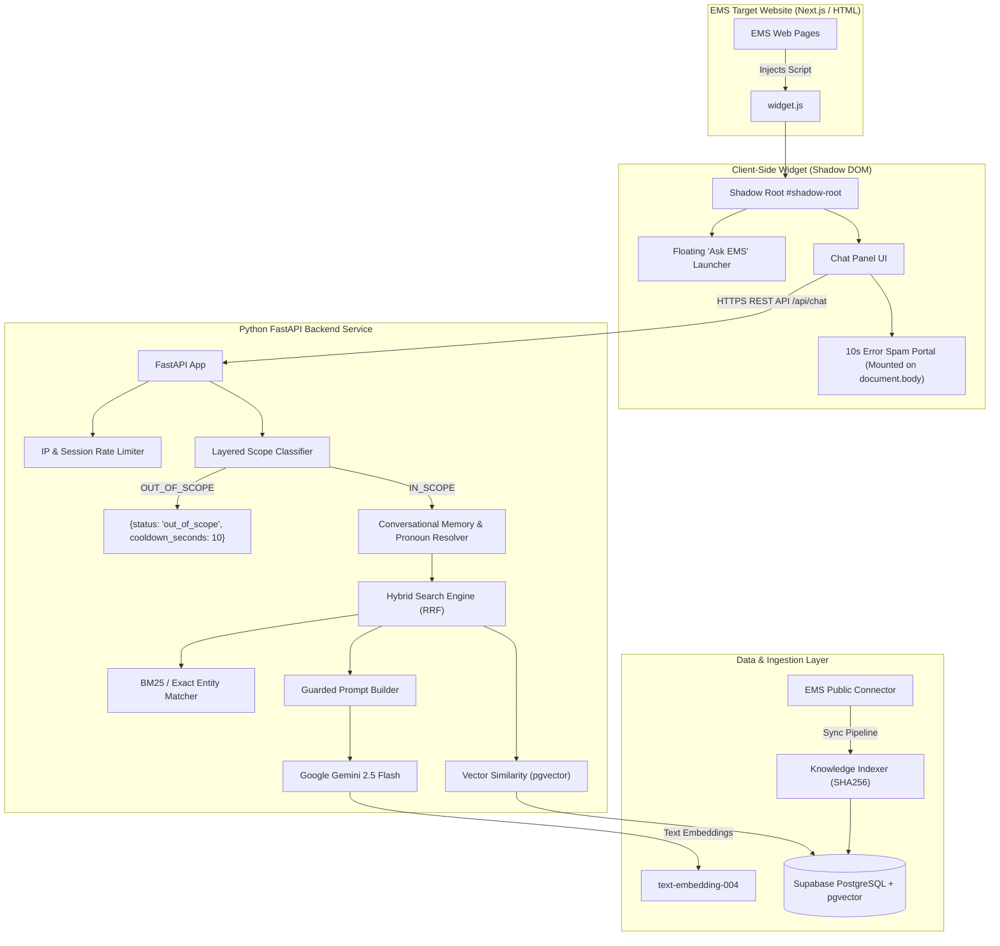

# System Architecture: EMS Assistant

EMS Assistant is a production-grade, standalone AI Event Assistant built specifically for the MLRIT CIE Event Management System (EMS). It provides intelligent, grounded event discovery and participation guidance through a decoupled, embeddable architecture.

---

## 1. High-Level System Architecture

---

## 2. Key Architectural Tenets

1. **Zero Coupling to EMS Source Tree**:
   - The chatbot runs as an autonomous service on its own server/container.
   - Host integration requires only one standard `<script src="https://.../widget.js">` tag.
   - Completely independent deployment and scaling cycles.

2. **Shadow DOM Style Isolation**:
   - The entire widget UI (buttons, panels, cards, inputs, scrollbars) is encapsulated within an open Shadow Root.
   - Host website CSS (Tailwind, Bootstrap, or custom stylesheets) can never bleed into or break the chatbot UI.
   - Chatbot styles cannot affect any host website layout.

3. **Grounded RAG Factuality Guarantee**:
   - Event-specific facts (dates, venues, deadlines, fees, rules, team sizes, eligibility) are drawn exclusively from retrieved EMS knowledge chunks.
   - Gemini is strictly forbidden from fabricating event attributes.
   - Missing attributes trigger a clear statement: *"I couldn't find that specific information in the current EMS data."*

4. **Multi-Layered Scope & Injection Guardrails**:
   - **Layer 1: Heuristic Filter & Injection Detector**: Evaluates SQL patterns, system prompt extraction strings, and overt off-topic triggers.
   - **Layer 2: Page Context & Conversational Context**: Preserves continuity when users ask context-dependent questions (*"What is the team size?"* or *"Where is it?"*).
   - **Layer 3: Structured Gemini JSON Classifier**: For ambiguous inputs, invokes Gemini in strict JSON mode to classify as `IN_SCOPE`, `AMBIGUOUS`, or `OUT_OF_SCOPE`.

5. **10-Second Intentional Error Spam Effect**:
   - When an out-of-scope query is verified, the backend returns `{ status: "out_of_scope", cooldown_seconds: 10 }`.
   - The widget activates an accessible, full-screen visual overlay that randomly spawns warning badges across the viewport with randomized rotations, scales, shake/pulse animations, and locked input.
   - Automatically cleans up all timers and restores normal chat functionality after exactly 10 seconds.
